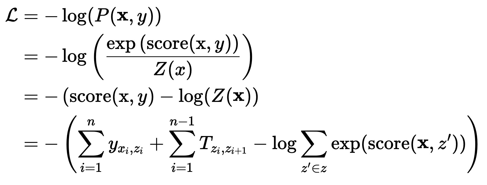

# 智能对话信息诊疗信息抽取

## 1 介绍

 该项目为2024华中农业大学信息学院人工智能专业大三暑期实训任务，NLP方向。

该项目的主题为自动化医疗问诊系统，主要包括三个NLP任务：
- 命名实体识别：
  从医患对话中识别关键信息，如疾病名称、药物名称、症状描述等。
- 症状检查识别：
  在医患对话中准确识别患者的症状，并识别症状与病人之间的关系。
- 医疗报告生成：
  依据病人和医患的对话，输出具有规定格式的医疗报告。

## 2 内容
### 2.1 命名试题识别（NER）
该任务是一个序列标注问题，主要包括五类医疗相关实体，包括：症状、药品名、药物类别、检查和操作。采用`BIO`标注体系，其中`B`和`I`标签后面跟随有实体类型。

针对该任务，构建了三种深度学习模型，分别如下：
1. **Bi-LSTM + CRF**
   LSTM加CRF是NLP中序列标注的基本模型，LSTM为一个编码器，CRF为解码算法。
   具体模型结构如下：
   - 序列编码
     
     $$\mathbf{x}=[x_1,x_2,x_3,\cdots],\\
     H = \text{LSTM}(\text{Embedding}(\mathbf{x})) = [h_1, h_2, \cdots]$$

   - 线性层分类
     
     $$y = HW + b$$
   - 输入CRF层
    CRF层的原理：
    在CRF中有一个发射矩阵和一个转移矩阵，发射矩阵是隐藏状态到观察状态的概率得分，转移矩阵是前一个观察状态转移到后一个观察状态的概率得分。对于一个序列和指定的目标标签，这个序列的得分计算公式如下：

    $$\text{score}(\mathbf{x},z) = \sum_{i=1}^n{y_{x_i,z_i}} + \sum_{i=1}^{n-1}{T_{z_i,z_{i+1}}}$$
   
    $y_{x_i,z_i}$是隐藏状态 $x_i$ 转移到观察状态 $z_i$的得分，可以由之前的线性层的输出结果得到。 $T_{z_i,z_{i+1}}$是转移矩阵中的第 $i$个观察状态转移到第 $i+1$个状态的概率得分。
    发射矩阵就是通过LSTM编码后的向量经过线性层得到的结果，转移矩阵是CRF中待学习的参数。
    最后经过维特比解码算法求解：

    <div style="text-align: center">
      
    </div>
     <!-- $$z^* = \argmax_z \text{score}(\mathbf{x},z)$$ -->
   
    补充损失函数计算：
    损失函数根据最大似然，采取最小化条件概率负对数的方法计算，CRF是一种判别模型，用于直接建模输出序列 $y$ 在给定舒序列 $x$ 的条件概率 $P(y|x)$ ，这个条件概率可以写成：
   
    $$P(y|x) = \frac{\exp{(\text{score}(\mathbf{x},y))}}{Z(x)}$$
   
    其中：
      - $\text{score}(x,y)$ 是输入序列于目标标签的总得分。
      - $Z(x)$ 是归一化因子，用来确保所有可能的序列标签的概率之和为1。
      - $Z(x)$的计算公式如下：
  
        $$Z(x) = \sum_{z'\in z} \exp{\text{score}(\mathbf{x},z')}$$
      - $z$是所有可能的序列标签的集合。

    对于一个序列，它的损失函数计算公式如下：
    
    
    <!-- ```math
    \begin{aligned}
            \mathcal{L} &= -\log(P(\mathbf{x},y)) \\
            &= -\log \left(\frac{\exp{(\text{score}(\text{x},y))}}{Z(x)}\right) \\
            &= -\left(\text{score}(\text{x},y) - \log(Z(\mathbf{x})\right) \\
            &= -\left (\sum_{i=1}^n y_{x_i,z_i} 
            + \sum_{i=1}^{n-1}T_{z_i,z_{i+1}}
            - \log \sum_{z'\in z} \exp(\text{score}(\mathbf{x},z'))
            \right )
        \end{aligned}
    ``` -->

    穷举所有的可能序列计算分数复杂度很高，可以通过转移的方式计算$Z(\mathbf{x})$，具体推导过程见CSDN [BiLSTM中的CRF层（三）CRF损失函数](https://blog.csdn.net/u013963380/article/details/108696552)

3. **Bi-LSTM + word-level feature + CRF** 
   前面的模型之使用了字符级别的特征，在这个模型中，还是使用了词级别的特征并且通过注意力机制融合两种特征。
   具体模型设计如下：
   - 字符/词分割
     
     $$\mathbf{x} = \text{CharSplit}(\text{text}) = [x_1,x_2,\cdots]$$
   
     $$\mathbf{c} = \text{WordSplit}(\text{text}) = [c_1,c_2,\cdots]$$

   - 序列编码
     
     $$H_x = \text{LSTM}(\text{Embedding}(\textbf{x})) \in \mathbb{R}^{l \times d}$$

     $$H_c = \text{LSTM}(\text{Embedding}(\textbf{c})) \in \mathbb{R}^{s\times d}$$

   - 注意力融合
     
     $$Q =  W_QH_c^T \in \mathbb{R}^{s \times d}$$
     
     $$K =  W_KH_x^T \in \mathbb{R}^{l \times d}$$
     
     $$V=W_VH_c^T \in \mathbb{R}^{s \times d} $$
     
     $$H_x' = H_x+\text{softmax}(\frac{KQ^T}{\sqrt{d}})V$$

   - 线性层分类
  
     $$y = H_x'W + b$$

   - CRF解码
     
     同前

5. **BERT + CRF**
   同第一个，将编码器换成了BERT。

所有的模型均在model.py文件中，三个模型分别对应`NerModelLSTM`，`NerModelLSTMWord`，`NerModelBert`。

命名实体识别模型实验结果

|Model|dev F1|test F1|
|---|---|---|
|LSTM+CRF|0.9525|0.9526|
|LSTM+word feature+CRF|0.9628|0.9633|
|BERT+CRF|**0.9789**|**0.9781**|

### 2.2 症状识别
该任务要求从医患对话文本中识别出病人描述的症状信息，后续根据对话判断是否存在该症状。语料中包含329种标准化的症状名称。

该任务包含两个子任务，一个是对语料中识别出的实体进行标准化，另一个是根据对话判断病人是否存在该症状。对话语料为多句对话，一问一答的形式，所以解决该任务可以直接输入所有的问答数据，也可以一个问答一个问答地解决。这里采用的方案是第二种，第二种方案理论上会对症状存在性判断产生一定的影响。

**任务一：症状标准化**

1. **Word2Vec标准化**
  
    基本思路是根据语料训练一个Word2Vec模型，然后计算标注实体和标准化实体之间的相似度，取相似度最高的词作为标准化结果。
    分为以下几个步骤：
   - 数据集分词，Word2Vec训练
   - 根据BIO标签获取症状实体
   - 症状实体和标准化 
   - F1分数评估

    由于分词的原因，可能会存在一些标注出来的实体的词语不存在于Word2Vec模型之中，导致出错，这里可以采取拆分的解决方法，训练的时候把所有的单个字也用于训练，当找不到目标词的时候，将词拆成字，然后将所有字的对应的向量求和作为这个词的向量。

1. **BERT标准化**
   
   使用预训练的BER模型进行标准化，直接再BERT后面接线性层进行分类即可。由于一个实体可能包含多个token，这里使用特殊token“*”来标记实体，将这个特殊token的embedding作为这个实体的embedding。分为以下几个步骤:
   - 给序列添加特殊token“*”

      $$\text{Text} = [t_1,t_2,*,t^e_3,t^e_4*,\cdots]$$
   - 序列编码

      $$H = \text{BERT} = [h_1,h_2,\cdots]$$
    
   - 取出实体编码，线性层分类

      $$h_{e_i} = H[pos^*_i]$$

      $$P^{e_i} = \text{softmax}(Wh_{e_i} + b)$$
    
    - 损失函数

      $$\mathcal{L} = -\frac{1}{|\mathcal{E}|}\sum_{e \in \mathcal{E}} \sum_i^k y^e_i\log(p^e_i)$$

**任务二：症状识别**

  一段对话中，可能存在多个症状实体，或者没有症状实体，一个一个挑选出来很麻烦，为了实现较高的并行计算效率，分类模型直接对331种症状进行有、无和不确定的三分类。具体做法是构建一个 $M\in \mathbb{R}^{m\times d}$ 矩阵，后续使用带 $\tanh$ 激活的Hadamard积的形式来融合句子嵌入和症状矩阵， 最后通过一个线性层进行分类。

1. LSTM+softmax
  
    LSTM作为编码器，然后分类，第一个token的embedding作为整个句子的embedding（这里不应该这样做的，选择最后一个应该要好一点，或者对填充部分做一个mask，然后使用注意力机制融合得到句子的embedding更好）。

    - 序列编码，获得句子嵌入

      $$H = \text{BERT}(\mathbf{x})$$

      $$h_s = H[0]$$

    - 融入症状向量矩阵，进行线性分类

      $$p = W(\tanh(h_s\odot M)^T) + b$$

    - 损失函数

      $$\mathcal{L} = -\frac{1}{n}\sum_{i=1}^n \sum_{j=1}^ky_i\log(p_j)$$

2. BERT+softmax
  
   换汤不换碗

3. BERT+Syntax Tree+GAT

    构建句法树，然后使用图注意力卷积融合embedding

    - 使用spacy构建语法树

      $$\text{Edge} = \text{spacy}(\mathbf{x})$$

      

    - 序列编码，获得句子嵌入

      $$H = \text{BERT}(\mathbf{x})$$

    - 使用图注意卷积

      $$H'=\text{GAT}(H,\text{Edge})$$

      $$h_s' = H[0]$$
    
    - 融入症状向量矩阵，线性分类

      $$p = W(\tanh(h_s\odot M)^T) + b$$

    - 损失函数

      同前

**实验结果**

症状标准化：
  |Model|dev F1|test F1|
  |---|---|---|
  |Word2Vec|0.48|0.42|
  |BERT|**0.9865**|**0.9901**|

症状识别
  |Model|dev F1|test F1|
  |---|---|---|
  |BERT+softmax|**0.7591**|**0.7598**|
  |BERT+Syntax Tree+GAT|0.7562|0.7545|
  |LSTM+softmax|0.7537|0.7488|


### 2.3 医疗报告生成

使用生成式模型BART来生成报告。
- 首先进行数据处理，获得对话内容和目标报告文本

  从数据集中获得对话文本，前面加上角色

  

  报告内容用竖线｜连接起来

  

- 对话文本作为输入内容，报告内容作为输出目标微调BART模型

实验结果

|Model|dev-rougue1|dev-rougue2|dev-rogueL|test-rouge1|test-rouge2|test-rougeL|
|---|---|---|---|---|---|---|
|BART|0.0003|0.0001|0.0003|0.0003|0.0001|0.0003|

> rouge评估的代码可能有些问题，所以导致rouge的分数很低，最后的输出的文本结果还是能够看一点的，感觉评分不应该这么低。

样例展示：

- 输入
  
  

- 输出

  

- 目标；

  


## 3 总结

这次实训的NLP任务是一个信息抽取相关的项目，涉及序列标注、实体标准化、分类、生成式任务。都是NLP的经典任务，通过此次实训，能够有效提升对一些经典模型例如LSTM、BERT的使用熟练度和深度学习模型训练和评估的编码能力。

总体来说，该项目的完成度不错，多种方式，多种模型均有实现。有一些细节方面有些不足，比如Word2Vec实体标准化那里对于不存在的词没有使用字拆解来替代。任务之间没有使用上一个人的预测结果来进行模型评估，而是直接使用数据集中的结果来进行的评估，所以和真实的任务评估相比较，后续的任务的评估分数是偏高的。

